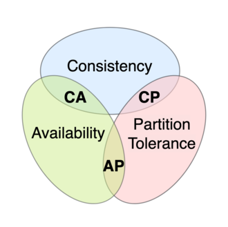

# CAP Theorem

Distributed Data Store can only provide two of the following three guarantees.

#### Consistency

Every read receives the most recent write or an error.

#### Availability

Every request receives a (non-error) response, without the guarantee that it contains the most recent write.

#### Partition tolerance

The system continues to operate despite an arbitrary number of messages being dropped (or delayed) by the network between nodes.

### In Practice

> No distributed system is safe from network failures, thus network partitioning generally has to be tolerated

When a network partition failure happens, it must be decided whether to do one of the following:

* cancel the operation and thus decrease the availability but ensure consistency
* proceed with the operation and thus provide availability but risk inconsistency.

CAP theorem indicates that we can’t have availability and consistency under network partitions.

<figure><figcaption></figcaption></figure>

